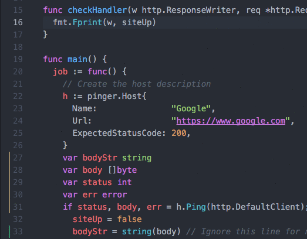

# Chapter 06 - Using a debugger!

## Goal

Demonstrate how to use a debugger with Go to inspect variables.

## Open Output panel

On the bottom right corner, there's a button to "Toggle output panel".
Click that button to open the "Output messages" panel


## Add breakpoints

Add breakpoints by clicking on the space left of the line number.



## Slow down the scheduler.

Right now, the debugger in Atom does not work 100%. If we have a breakpoint in the scheduler thread / goroutine  (which runs every 5 seconds) and a breakpoint in the handler routine whenever we receive a request, it can strain Atom.
For now, set the scheduler to run 120 seconds:

```go
scheduler.Every(120).Seconds().Run(job)
```

## Start debugging.

0. Press "Debug"
0. Press the play button once to start the program.
0. It should break on the first iteration of the scheduled job. Hit the "right" arrow to go to the next instruction and inspect the variables.
0. Once done with job, press the "play" button and open your browser to [http://localhost:8080/check](http://localhost:8080/check) and it should break on the `checkHandler`
0. Press the stop button to finally stop debugging.
